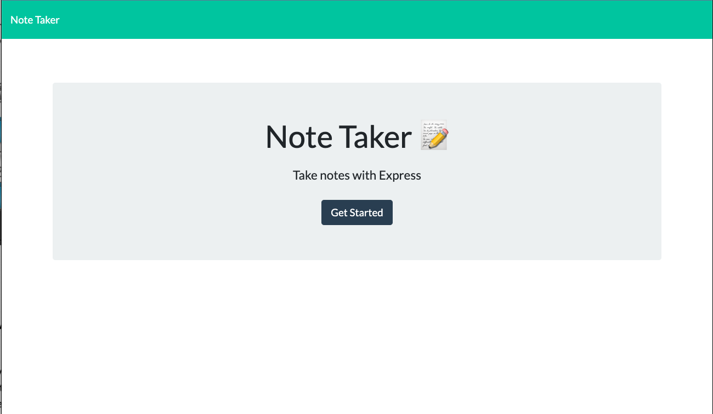
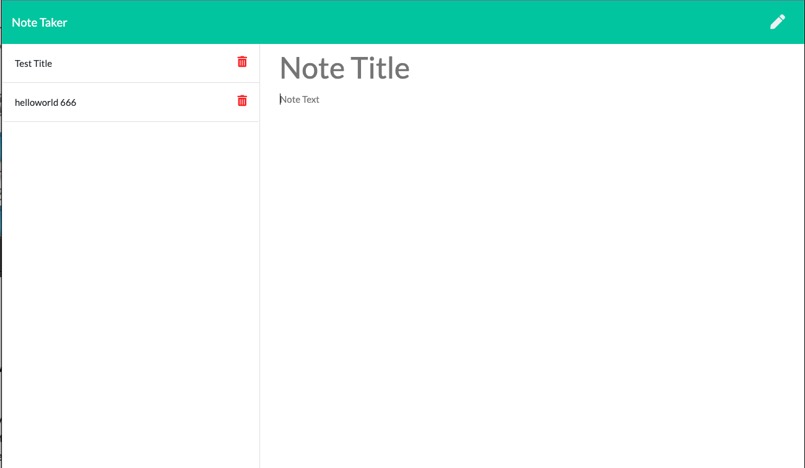

# Note-taker

An application is designed to allow user create, save, and delete notes. 
This application uses express backend.
It save and retrieve data from a JSON file.

Deployment on Heroku

https://note-taker2123.herokuapp.com/

Screen shoot

